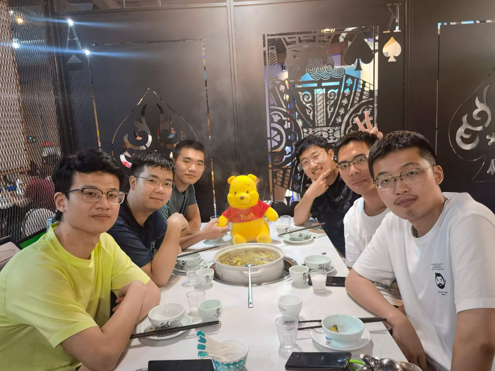

Hi! I'm Yiming Wang, a first-year graduate student (M.S. in Data Science) learning at Harvard University who has interests in Natural Language Processing, especially large language model. Apart from my undergraduate study, I also worked as RA for Prof. [Tao Yu](https://taoyds.github.io/) in HKU and Prof. [Baobao Chang](https://cs.pku.edu.cn/info/1181/1543.htm) in PKU.

In summer 2022, I went on a <b>fabulous</b> journey to Kunming, a beautiful city in China, with [Tianbao Xie](https://tianbaoxie.com/), [Chengxi Li](https://baigker.github.io/Home-Page/), [Yuhang Lai](https://halfrot.github.io/), [Hongjin Su](https://hongjin-su.github.io/) and [Shuyang Jiang](https://scholar.google.com/citations?user=slwTiOUAAAAJ&hl=zh-CN&oi=ao), organized and supported by [Tao Yu](https://taoyds.github.io/). I've also learned a lot from [Da Yin](https://wadeyin9712.github.io/#pic_center=100x). 

I'm also a football⚽️ rookie. Vamos Argentina🇦🇷🦅!
